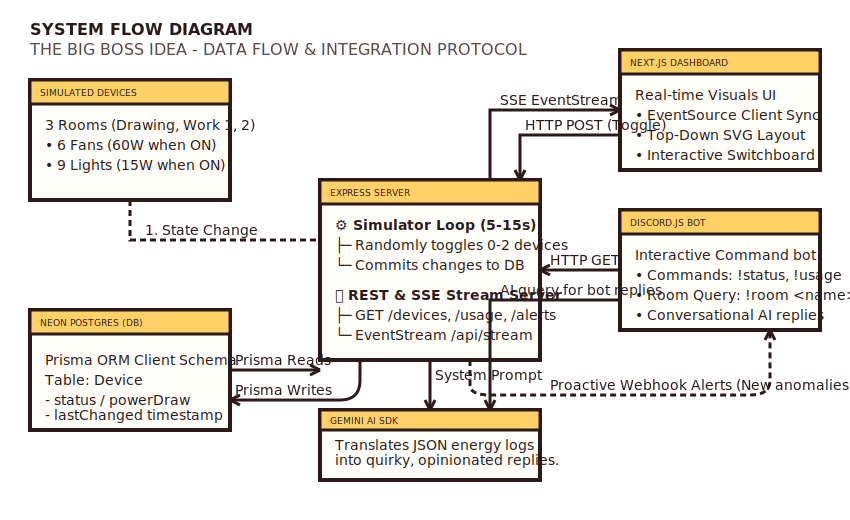

# ⚡ The Big Boss Idea
### National Hackathon MVP - Office Energy Monitoring System

"The Big Boss Idea" is a Nintendo-style (Stardew Valley / Animal Crossing UI vibe) office energy monitoring system designed to keep employees accountable for active device waste. It features an Express backend hosting a simulated device data layer (Postgres via Prisma), a Next.js real-time visual web dashboard, and an opinionated Discord bot that queries active device logs and generates conversational, cheeky energy reviews using the Gemini AI SDK.

---

## 🗺️ System Flow Diagram

The high-level integration architecture and data flows are illustrated below:



---

## ⚙️ Setup & Installation

### Step 1: Environment Configuration
1. In the root directory, copy `.env.example` to `.env`:
   ```bash
   cp .env.example .env
   ```
2. Open `.env` and fill in your actual credentials:
   * **`DATABASE_URL`**: Your Neon Postgres connection string.
   * **`AI_API_KEY`**: Your Gemini API key.
   * **`DISCORD_BOT_TOKEN`**: Your Discord bot token.
   * **`DISCORD_WEBHOOK_URL`**: Your Discord alert channel Webhook.
3. Sync the `.env` configuration file to all folders:
   * **PowerShell**: `Copy-Item .env backend\.env; Copy-Item .env bot\.env`
   * **Bash**: `cp .env backend/.env && cp .env bot/.env`

### Step 2: Database Migration & Seeding
Navigate to `/backend`, run schema migrations (to deploy the `Device` and `AlertLog` tables), and seed the starting 15 devices with randomized past timestamps:
```bash
cd backend
npm install
npx prisma generate
npx prisma migrate dev --name init_energy_db
npx prisma db seed
```
*Note: Seeding creates all 15 devices (Drawing Room: 2 fans, 3 lights; Work Room 1: 2 fans, 3 lights; Work Room 2: 2 fans, 3 lights) with a realistic mix of ON/OFF states and randomized past offsets (0 to 4 hours ago) so that stuck-on alerts are testable immediately.*

---

## 🚀 Running the Services

### 1. Launch the Backend API & Simulation Loop
Starts the server on `http://localhost:5000` (along with the weighted day/night simulation loop):
```bash
cd backend
npm run dev
```

### 2. Launch the Discord Bot
Starts the Discord bot client:
```bash
cd bot
npm install
npm run dev
```

---

## 🎮 How to Demo Alerts (For Judges)

The system automatically computes alerts and logs them to the `AlertLog` table in your database. You can easily trigger and demonstrate alert states:

### 1. Stuck-On Alert Demo (Quick-test)
* The stuck-on alert checks for devices that remain ON for too long (defaulting to 2 hours).
* To demo this in 2 minutes:
  1. Set `STUCK_ON_THRESHOLD_MS=120000` (2 minutes) in your `.env` and sync to backend.
  2. Start the backend, or manually toggle a device ON:
     ```bash
     curl -X POST http://localhost:5000/devices/work1-fan-1/toggle
     ```
  3. Wait 2 minutes.
  4. Query `/alerts` or view your Discord alert channel:
     ```bash
     curl http://localhost:5000/alerts
     ```
     *Gemini will generate a quirky message warning you about the device left ON, send it to Discord, and log the active alert. Once turned off, the alert log resolves (`resolved = true`).*

### 2. After-Hours Alert Demo
* The after-hours alert triggers if any device is ON outside the 9 AM – 5 PM local window.
* To demo this during normal business hours:
  1. Temporarily modify your system clock (or edit `isAfterHours` in [alerts.ts](file:///d:/new_wrkspc/techathon_hackathon_2026/backend/src/alerts.ts#L33) to `true`).
  2. Run the backend and ensure a device is turned ON.
  3. Query `/alerts` or inspect your Discord webhook alerts channel.
