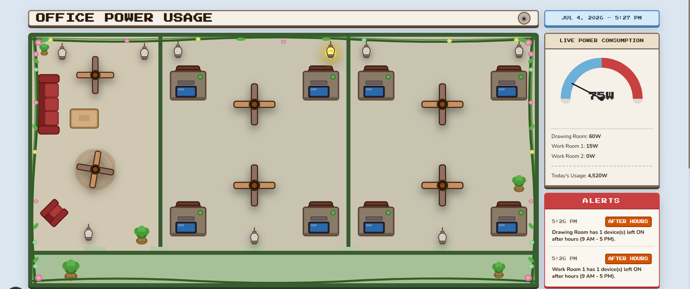
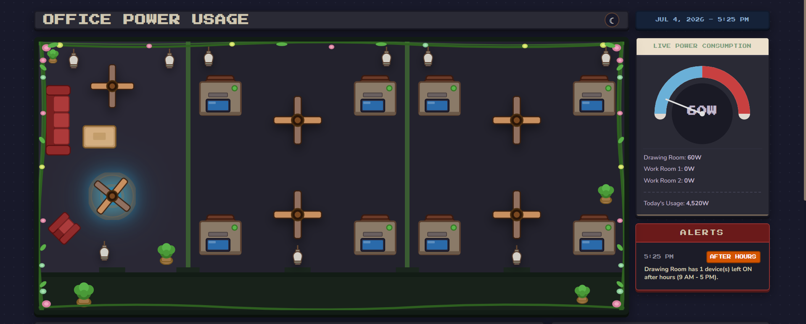
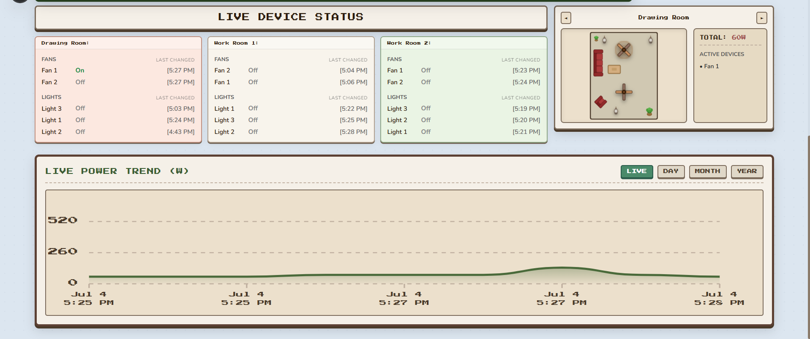
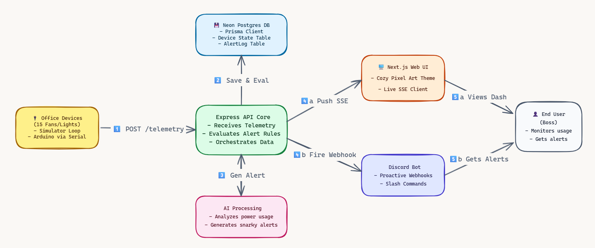
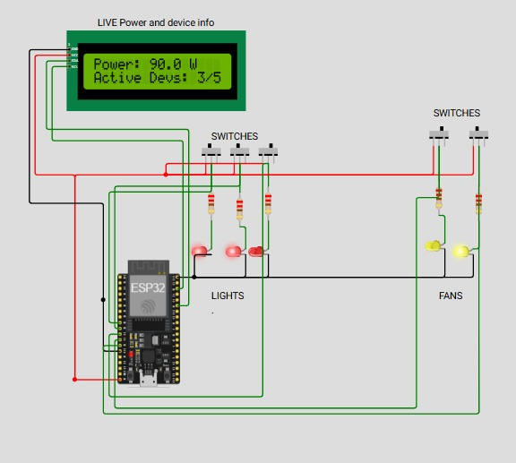

#  The Big Boss Idea

> by team **IUT_zeroWin** for IUTRS Techathon 2026 Hackathon

---

##  Google Drive Video Demo
> 🎥 **Watch the 3-Minute Walkthrough:** [Google Drive Demo Video Link](https://drive.google.com/drive/folders/1j_BLsO_BZpWuDSEtGhrJvv4jLnvzzM_L?usp=sharing)
>


---

##  Interactive Web Showcase

Instead of cold, corporate data tables, **The Big Boss Idea** wraps workplace conservation in a delightful visual layout inspired by retro titles like *Stardew Valley* and *Animal Crossing*.

###  Cozy Day & Night UI Themes
The interface automatically transitions its visual style based on local client hours (or via a manual header override). Below, see how the office shift looks in daylight versus a cozy night layout with illuminated glows:

|  Day Mode |  Night Mode |
| :---: | :---: |
|  |  |

### 📊 Real-time Device Operations & Analytics
Toggle active devices to instantly sync Wattage across the top-down pixel map and view system anomalies (like after-hours usage or devices left on too long):



---

##  Quick-Start Guide (Setup & Running)

This repository is built as a unified monorepo. All services (Backend, Dashboard, Discord Bot) load configuration details from a **single, central `.env` file** in the repository root.

### 1. Configure the Environment
Copy the environment template in the repository root:
```bash
cp .env.example .env
```
Open `.env` and insert your credentials:
* `DATABASE_URL`: Connection string (PostgreSQL/Neon).
* `AI_API_KEY`: Google Gemini or provider API key.
* `AI_API_KEY`: Google Gemini or provider API key.
* `DISCORD_BOT_TOKEN`: Discord Bot API client token.
* `DISCORD_WEBHOOK_URL`: Discord alert channel webhook.

### 2. Deploy Database & Seed Starting Data
Deploy the Prisma schema to Postgres and seed the starting room devices:
```bash
cd backend
npm install
npx prisma generate
npx prisma migrate dev --name init_db
npx prisma db seed
```

### 3. Run Services
Launch each system service in a separate terminal from the root folder:

* **Terminal 1: Express API & Simulator**
  ```bash
  cd backend
  npm run dev
  ```
  *(Starts Server-Sent Events, endpoints, and the workday device occupancy loop)*

* **Terminal 2: Next.js Web Dashboard**
  ```bash
  cd dashboard
  npm install
  npm run dev
  ```
  *(Dashboard runs live at http://localhost:3000)*

* **Terminal 3: Discord Bot Client**
  ```bash
  cd bot
  npm install
  npm run dev
  ```


---

##  System Blueprints & Hardware

### 1. High-Level System Architecture
Flow of telemetry information from simulated hardware endpoints down to the databases, REST interfaces, client UIs, and the Discord server:



> [!TIP]
> The original Excalidraw design source is located at [assets/system_diagram.excalidraw](./assets/system_diagram.excalidraw). You can import it back into [Excalidraw](https://excalidraw.com) to edit or inspect.

### 2. ESP32 Physical Circuit Schematic
Wiring blueprint representing a single office room's physical sensor network and output relays:



* **Microcontroller:** ESP32 DevKit V1
* **Relay-Controlled Outputs:** 3 Lights (GPIO 12, 14, 27) and 2 Fans (GPIO 26, 25)
* **Telemetry Sensing:** ACS712 Current Sensor reading total power draw (ADC Pin 34)
*  **Live Simulator:** [Simulate the ESP32 circuit on Wokwi](https://wokwi.com/projects/468548194305602561)
*  **Hardware Files:** Arduino sketch and component mappings can be inspected in the [Circuit-Schema](./Circuit-Schema) directory.

---

## Features & Technology Stack

Our system is structured as a unified monorepo leveraging lightweight services designed to work in synergy:

### Frontend: Next.js (TypeScript) & Vanilla CSS
* **Retro Cozy-Cottage Aesthetic:** Instead of flat, corporate dashboard grids, the dashboard is themed after games like *Stardew Valley* and *Animal Crossing*. It features custom top-down office layouts, spinning fan blades (driven by CSS keyframe animations), and warm lightbulb glows.
* **Day & Night Transitions:** Theme styles shift between warm parchment (day) and dusky indigo (night) automatically based on the user's local clock (or manual override).
* **Real-time Event Synchronization (SSE):** Utilizes Server-Sent Events (SSE) to push instant state updates across all active dashboard clients, ensuring zero manual page refreshes when a device toggles.

###  Backend: Node.js, Express (TypeScript) & Prisma ORM
* **Unified Neon PostgreSQL Database:** Stores device details and persistent alert configurations under a single source of truth.
* **Workday-Weighted Simulator Engine:** Features a custom background loop simulating active office occupancy. Devices organically toggle on and stay on during core business hours (9 AM - 5 PM) and have a high probability of shut-off in the evening.
* **Stateful Anomaly Logging:** Automatically monitors and flags devices left on after-hours or active for too long (> 2 hours), persisting alerts in the `AlertLog` table to prevent duplicate notifications.

### Chat Assistant: Discord.js & Google Gemini AI
* **Cheeky Energy Reviews:** The Discord bot processes raw database telemetry and routes it through the Gemini AI SDK, translating dry metrics into humorous, conversational, and highly opinionated energy reports (queried via `!status`, `!usage`, or `!room`).
* **Auto-Resolving Webhook Alerts:** Posts alert notifications directly to your Discord channel when anomalies are first detected. When the device is toggled off, the system automatically resolves the warning in the database.
